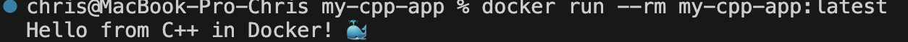

# C++ CI/CD Pipeline App


Учебный пример настройки CI/CD для приложения на **C++** с использованием **GitHub Actions**, **CMake**, **Google Test** и **Docker**.

## Содержание

- [Описание проекта](#описание-проекта)
- [Функционал CI/CD](#функционал-cicd)
- [Требования](#требования)
- [Структура проекта](#структура-проекта)
- [Запуск локально](#запуск-локально)
- [Тестирование](#тестирование)
- [Сборка Docker-образа](#сборка-docker-образа)
- [Лицензия](#лицензия)

## Описание проекта

Проект демонстрирует сборку C++ кода, запуск unit-тестов и упаковку бинарного файла в Docker-образ с помощью multistage-сборки. Пайплайн автоматически реагирует на изменения в ветке `main` (push и pull request).

## Функционал CI/CD

Пайплайн настроен в файле [`.github/workflows/ci.yml`](.github/workflows/ci.yml) и выполняет следующие шаги:

| № | Шаг | Описание |
|---|-----|----------|
| 1 | **Форматирование** | Проверка стиля кода с помощью `clang-format` |
| 2 | **Сборка и тестирование** | Установка зависимостей (Google Test), конфигурация через CMake и запуск unit-тестов |
| 3 | **Сборка Docker-образа** | Изолированная компиляция приложения на базе Ubuntu 22.04 и перенос готового бинарника в минимальный образ |

## Требования

- CMake 3.20+
- Компилятор с поддержкой C++17 (GCC 11+ / Clang 14+)
- Google Test
- Docker 24+

## Структура проекта

```
.
├── .github/
│   └── workflows/
│       └── ci.yml           # Конфигурация пайплайна
├── src/                      # Исходный код приложения
├── include/                   # Заголовочные файлы
├── tests/                     # Unit-тесты (Google Test)
├── CMakeLists.txt
├── Dockerfile                  # Multistage-сборка образа
├── .clang-format
└── README.md
```

## Запуск локально

Конфигурация и сборка проекта через CMake:

```bash
cmake -S . -B build -DCMAKE_BUILD_TYPE=Release
cmake --build build
```

Запуск приложения:

```bash
./build/my-cpp-app
```

## Тестирование

Проверка форматирования кода:

```bash
clang-format --dry-run --Werror src/*.cpp include/*.hpp
```

Сборка с тестами и их запуск:

```bash
cmake -S . -B build -DBUILD_TESTS=ON
cmake --build build
ctest --test-dir build --output-on-failure
```

## Сборка Docker-образа

Сборка проекта в Docker-образ:

```bash
docker build -t my-cpp-app:latest .
```

Проверить, что образ создался:

```bash
docker images | grep my-cpp-app
```

Запуск контейнера:

```bash
docker run --rm my-cpp-app:latest
```
#


## Лицензия

Проект распространяется под лицензией MIT — см. файл [LICENSE](LICENSE).